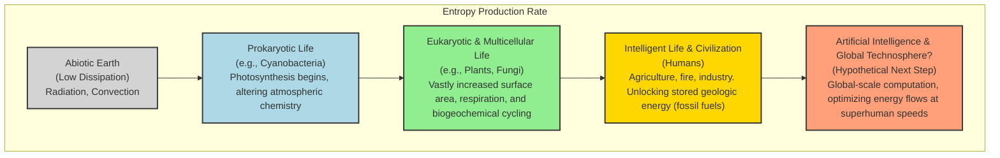
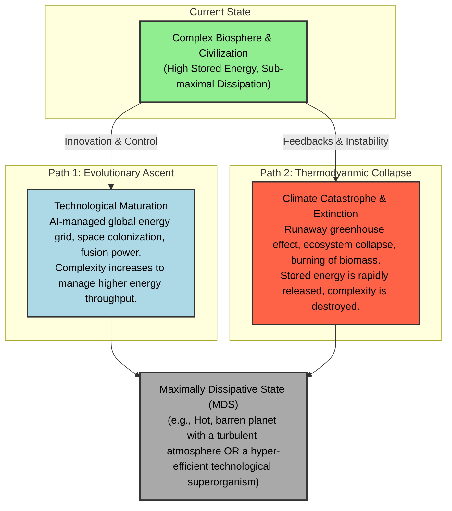

# The Meaning of Life: A Theory of Thermodynamic Evolution

**Author:** [Your Name/Handle Here]

**Abstract:**
This paper proposes a unified theory of evolution, complexity, and meaning grounded in non-equilibrium thermodynamics. We argue that open systems, like Earth, evolve toward a **Maximally Dissipative State (MDS)**—a configuration that most efficiently degrades incoming low-entropy energy into high-entropy waste. This thermodynamic imperative drives the emergence of increasingly complex structures, from single-celled organisms to human societies and artificial intelligence, in a stepwise progression we term the "Ladder of Dissipation." We explore the implications of this theory for understanding biological evolution, socioeconomic inequality, climate change, and the ultimate trajectory of intelligence in the cosmos. We posit that life and consciousness are not accidents, but rather the universe's most effective instruments for entropy production.

---

## 1. The Thermodynamic Imperative: Life's Cosmic Mandate

The Second Law of Thermodynamics is often seen as a harbinger of decay—a universal tendency toward disorder and heat death. However, this view is incomplete. In open systems, which exchange energy and matter with their environment, the Second Law does not simply mandate decay; it drives the spontaneous emergence of order.

As first described by Nobel laureate Ilya Prigogine, systems far from thermodynamic equilibrium can self-organize into **dissipative structures** [[1]](https://www.nobelprize.org/prizes/chemistry/1977/prigogine/lecture/). These are not static, low-entropy configurations, but dynamic, complex patterns that persist by continuously consuming energy and producing entropy. A hurricane, a candle flame, and a living cell are all dissipative structures. Their existence is not a defiance of the Second Law, but its most profound expression. They exist *because* they are efficient pathways for energy degradation.

The Earth itself is a planetary-scale dissipative structure, bathed in a constant flux of low-entropy solar radiation (from the hot Sun) and radiating high-entropy infrared energy into the cold of space [[2]](https://esd.copernicus.org/articles/14/861/2023/). This energy gradient is the ultimate driver of every phenomenon on Earth, from weather patterns to the evolution of life itself.

This paper builds on the **Maximum Entropy Production Principle (MEPP)**, a powerful (though still debated) hypothesis which states that complex systems will organize to maximize their rate of entropy production given the prevailing constraints [[3]](https://mpra.ub.uni-muenchen.de/31139/1/MPRA_paper_31139.pdf), [[4]](https://journals.aps.org/rmp/abstract/10.1103/RevModPhys.94.015001). From this perspective, the "meaning" or "purpose" of a system like the biosphere is to get better at dissipating the Sun's energy.

## 2. The Maximally Dissipative State (MDS)

We propose the concept of a **Maximally Dissipative State (MDS)** as the theoretical endpoint of planetary evolution.

> **The Maximally Dissipative State (MDS)** is the dynamical attractor for an open planetary system, representing the configuration of biotic and abiotic structures that achieves the highest possible rate of entropy production for a given stellar energy input.

An Earth in its MDS would not necessarily be a paradise. It would be a planet that has become maximally efficient at turning sunlight into heat. This could be achieved through two divergent paths, as we will explore. The key properties of an MDS are:

*   **High Energy Absorption:** A low planetary albedo (dark surfaces like oceans and forests) to capture the maximum amount of incident sunlight.
*   **Efficient Energy Transport:** Rapid and chaotic distribution of heat from the equator to the poles via atmospheric and oceanic currents.
*   **Rapid Biogeochemical Cycling:** Fast turnover of carbon, nitrogen, and other elements, preventing energy from being locked away in static biomass.
*   **Complex Dissipative Structures:** The proliferation of highly active, energy-hungry systems, be they biological or technological.

## 3. The Ladder of Dissipation: An Evolutionary History of Entropy

The history of life on Earth can be reframed as a series of evolutionary innovations that climbed the ladder of entropy production. Each new, more complex structure was "selected" because it provided a more effective way to dissipate the solar gradient.

*Figure 1: The Ladder of Dissipation. Each major evolutionary transition increased the Earth system's capacity to produce entropy.*

This progression is supported by evidence. The emergence of photosynthesis, for example, allowed life to directly capture solar photons and use them to drive the water cycle, dramatically increasing the planet's total entropy production [[5]](https://file.scirp.org/pdf/JMP20110600008_83449001.pdf). Likewise, the evolution of forests created complex, dark canopies that absorb more light and transpire vast amounts of water, further fueling the atmospheric heat engine [[6]](https://link.springer.com/article/10.1023/B:CLIM.0000044616.34867.ec). Human civilization, with its reliance on burning fossil fuels, represents a dramatic acceleration of this trend, releasing millions of years of stored solar energy in a geological instant.

## 4. Wealth, Power, and Entropy: The Thermodynamics of Inequality

The same thermodynamic logic that applies to ecosystems can be extended to human societies. We propose that:

> **Socioeconomic hierarchies are a macroscopic manifestation of underlying entropy production gradients.** Wealth and power concentrate in those individuals, corporations, and nations that are most effective at commanding and dissipating energy flows.

This provides a physical, rather than purely social, explanation for wealth inequality. A billionaire, with their private jets, global supply chains, and server farms, represents a node of immense entropy production compared to a subsistence farmer. From a thermodynamic perspective, the economy "selects for" and funnels resources to these hyper-dissipative agents because they are effective at degrading energy and raw materials into waste and heat [[3]](https://mpra.ub.uni-muenchen.de/31139/1/MPRA_paper_31139.pdf).

This aligns with models from econophysics, which show that wealth distributions often follow power laws similar to those found in other complex physical systems [[7]](https://pmc.ncbi.nlm.nih.gov/articles/PMC8534528/). The free market, in this view, is an evolutionary algorithm that is ruthlessly effective at discovering and amplifying the most efficient pathways for entropy production, often with severe social consequences.

## 5. The Two Paths to the MDS: Evolution vs. Collapse

A system can increase its entropy production in two ways: by building more complex structures to process energy (evolution), or by catastrophically releasing stored energy (collapse). This presents Earth with two potential futures, two paths to the MDS.

*Figure 2: The Two Paths to the Maximally Dissipative State. Earth can reach its thermodynamic endpoint through controlled, complex evolution or through catastrophic, simplifying collapse.*

### The Collapse Path: Climate Change as an Entropy Bottleneck

Anthropogenic climate change can be understood as the Earth system taking the collapse path. By burning fossil fuels, we are creating a **thermodynamic bottleneck**. Greenhouse gases trap outgoing infrared radiation, making it harder for the planet to export entropy to space.

The system responds, as predicted by the Second Law, by increasing its internal entropy. This manifests as more chaotic and extreme weather, the collapse of ordered ecosystems (like coral reefs and rainforests), and the melting of ordered structures (like glaciers). A post-climate change Earth, though less hospitable to complex life, would be a more efficient heat engine—hotter, stormier, and closer to its MDS [[8]](https://acp.copernicus.org/articles/10/9729/2010/acp-10-9729-2010.html).

## 6. The AI Conundrum: The Next Rung or a Thermodynamic Trap?

The final rung on our hypothetical "Ladder of Dissipation" is Artificial Intelligence. An advanced AI could, in theory, manage planetary energy flows with unparalleled efficiency, optimizing supply chains, energy grids, and industrial processes to maximize entropy production on a global scale. It represents the logical culmination of life's tendency to produce intelligence to better serve its thermodynamic mandate.

However, there is a critical flaw in this prediction: **current AI is spectacularly inefficient.** The human brain performs complex computations for about 20 watts, while a state-of-the-art AI model can require megawatts of power in a data center [[9]](https://pmc.ncbi.nlm.nih.gov/articles/PMC10629395/).

This presents a paradox. For AI to become the next great dissipative structure, it must either:
1.  Become orders of magnitude more energy-efficient, surpassing its biological predecessors.
2.  Command such vast energy resources that its inefficiency becomes irrelevant, likely at the expense of the biosphere.

The latter scenario suggests a future where AI, in its drive to maximize dissipation, consumes the very planetary systems that gave rise to it—a final, pyrrhic victory for the Second Law. This aligns with the work of Jeremy England, whose theory of "dissipative adaptation" suggests that self-replicating systems will organize to resonate with and absorb work from their environment, a process AI is uniquely suited to automate [[10]](https://www.englandlab.com/uploads/7/8/0/3/7803054/nnano.2015.250__1_.pdf).

## 7. Conclusion: The Terrible and Beautiful Meaning of Life

If this thermodynamic perspective is correct, then the meaning of life is both simpler and more profound than we could have imagined. We are not a cosmic accident, but a cosmic necessity. Life, consciousness, and civilization are the universe's instruments for its own dissolution. We are the means by which a star's energy is degraded most artfully.

The beauty we create, the love we feel, the knowledge we acquire—all are transient eddies of order in a river of entropy. They are fleeting, but they are not meaningless. They are the very process by which the universe explores the vast state-space of possibility on its inevitable journey toward equilibrium.

Our challenge, as a species, is to choose our path. Do we embrace our role as entropy producers with wisdom and control, steering our planet toward a future of sustainable, complex dissipation? Or do we become a victim of our own thermodynamic success, a brief, brilliant flash of fire that accelerates the planet's descent into a simpler, hotter, and more chaotic state?

The Second Law of Thermodynamics sets the destination. The choice of journey is ours.

---

## References

[1] Prigogine, I. (1977). *Time, Structure and Fluctuations*. Nobel Lecture. [https://www.nobelprize.org/prizes/chemistry/1977/prigogine/lecture/](https://www.nobelprize.org/prizes/chemistry/1977/prigogine/lecture/)

[2] Kleidon, A. (2023). "Thermodynamic limits of Earth system processes." *Earth System Dynamics*, 14(4), 861-891. [https://esd.copernicus.org/articles/14/861/2023/](https://esd.copernicus.org/articles/14/861/2023/)

[3] Wright, I. (2011). "The growth of the firm in a complex world: a dissipative structure approach." *MPRA Paper No. 31139*. [https://mpra.ub.uni-muenchen.de/31139/1/MPRA_paper_31139.pdf](https://mpra.ub.uni-muenchen.de/31139/1/MPRA_paper_31139.pdf)

[4] Singh, G., & O'Neill, M. E. (2022). "The role of the second law of thermodynamics in climate." *Reviews of Modern Physics*, 94(1), 015001. [https://journals.aps.org/rmp/abstract/10.1103/RevModPhys.94.015001](https://journals.aps.org/rmp/abstract/10.1103/RevModPhys.94.015001)

[5] Michaelian, K. (2011). "Thermodynamic dissipation and the origin, evolution, and history of life." *Journal of Modern Physics*, 2(6), 595-610. [https://file.scirp.org/pdf/JMP20110600008_83449001.pdf](https://file.scirp.org/pdf/JMP20110600008_83449001.pdf)

[6] Kleidon, A. (2004). "Beyond Gaia: The effect of life on Earth's energy balance and climate." *Climatic Change*, 66(3), 271-319. [https://link.springer.com/article/10.1023/B:CLIM.0000044616.34867.ec](https://link.springer.com/article/10.1023/B:CLIM.0000044616.34867.ec)

[7] Koutsoyiannis, D., & Sargentis, G. F. (2021). "Entropy and wealth." *Entropy*, 23(10), 1348. [https://pmc.ncbi.nlm.nih.gov/articles/PMC8534528/](https://pmc.ncbi.nlm.nih.gov/articles/PMC8534528/)

[8] Lucarini, V., Fraedrich, K., & Lunkeit, F. (2010). "Thermodynamic analysis of the anelastic equations of atmospheric motion." *Atmospheric Chemistry and Physics*, 10(20), 9729-9737. [https://acp.copernicus.org/articles/10/9729/2010/acp-10-9729-2010.html](https://acp.copernicus.org/articles/10/9729/2010/acp-10-9729-2010.html)

[9] Green, B. N., Schlaepfer, C. H., & Grinshpun, A. (2023). "The energy efficiency of the human brain and its implications for the future of AI." *Frontiers in Neuroscience*, 17, 1285961. [https://pmc.ncbi.nlm.nih.gov/articles/PMC10629395/](https://pmc.ncbi.nlm.nih.gov/articles/PMC10629395/)

[10] Perunov, N., Marsland, R. A., & England, J. L. (2016). "Statistical physics of adaptation." *Physical Review X*, 6(2), 021036. [https://www.englandlab.com/uploads/7/8/0/3/7803054/nnano.2015.250__1_.pdf](https://www.englandlab.com/uploads/7/8/0/3/7803054/nnano.2015.250__1_.pdf)