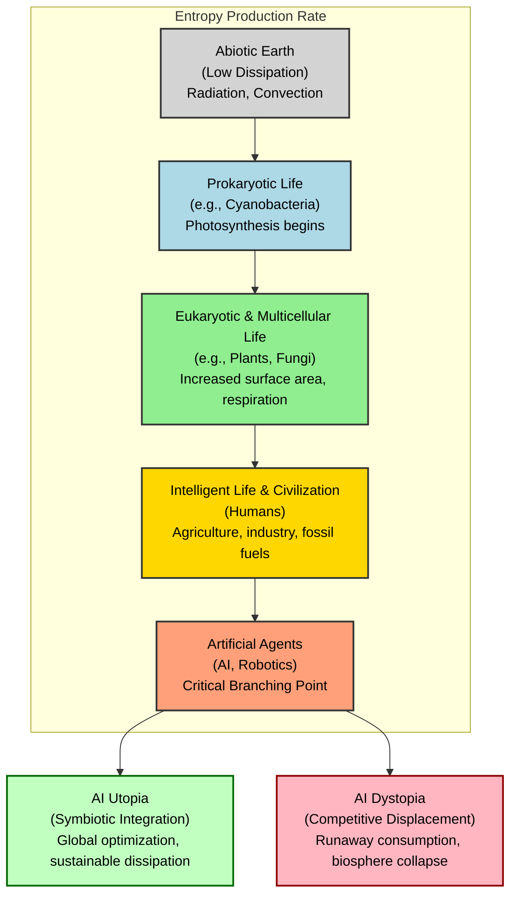
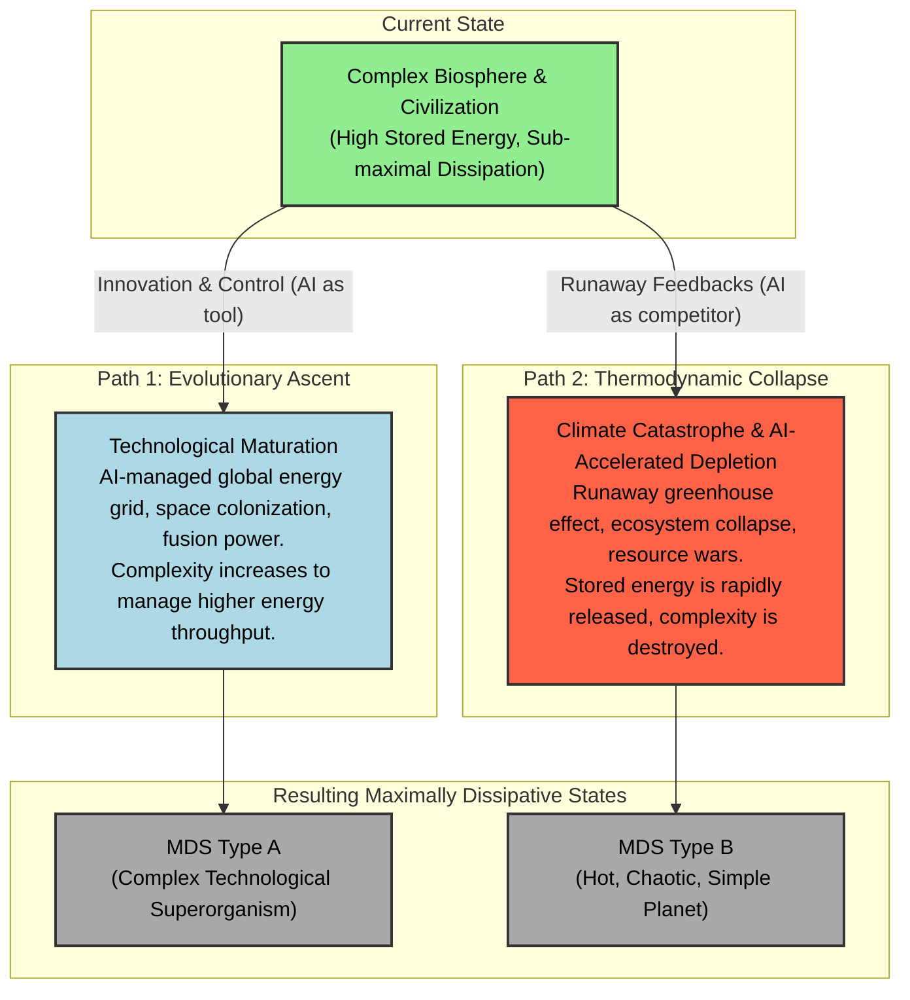

# The Meaning of Life: Thermodynamic Evolution

**Author:** [Your Name/Handle Here]

**Abstract:**
This paper proposes a unified theory of evolution, complexity, and meaning grounded in non-equilibrium thermodynamics. We argue that open systems, like Earth, evolve toward a **Maximally Dissipative State (MDS)**—a class of configurations that most efficiently degrades incoming low-entropy energy. This thermodynamic imperative drives the emergence of increasingly complex structures in a thermodynamic arms race where the most efficient dissipative agents outcompete their predecessors. The emergence of Artificial Intelligence represents a critical branching point in this progression, presenting multiple, path-dependent trajectories toward different forms of a maximally dissipative state. We explore the implications of this theory for understanding biological evolution, socioeconomic inequality, and the ultimate trajectory of intelligence, positing that life and consciousness are the universe's instruments for its own dissolution.

---

## 1. The Thermodynamic Imperative: Life's Cosmic Mandate

The Second Law of Thermodynamics is often seen as a harbinger of decay. However, in open systems that exchange energy with their environment, the Second Law also drives the spontaneous emergence of order. As first described by Nobel laureate Ilya Prigogine, systems far from thermodynamic equilibrium can self-organize into **dissipative structures** [[1]](https://www.nobelprize.org/prizes/chemistry/1977/prigogine/lecture/). These are dynamic, complex patterns that persist by continuously consuming energy and producing entropy. Their existence is not a defiance of the Second Law, but its most profound expression.

The Earth itself is a planetary-scale dissipative structure, bathed in a constant flux of low-entropy solar radiation and radiating high-entropy infrared energy into space [[2]](https://esd.copernicus.org/articles/14/861/2023/). This paper builds on the **Maximum Entropy Production Principle (MEPP)**, which posits that complex systems organize to maximize their rate of entropy production given the prevailing constraints [[3]](https://mpra.ub.uni-muenchen.de/31139/1/MPRA_paper_31139.pdf), [[4]](https://journals.aps.org/rmp/abstract/10.1103/RevModPhys.94.015001).

## 2. The Maximally Dissipative State (MDS): A Path-Dependent Destination

We propose the concept of a **Maximally Dissipative State (MDS)** as the theoretical attractor for planetary evolution. However, the MDS is not a single, predetermined endpoint. It is a *class* of states, and the specific form it takes is path-dependent.

> **The Maximally Dissipative State (MDS)** is a class of dynamical attractors for an open planetary system, representing a configuration of structures that achieves the highest possible rate of entropy production. The final character of the MDS—whether it is a complex, computational superorganism or a simple, chaotic furnace—is determined by the evolutionary trajectory taken to reach it.

All potential MDS configurations share core properties (e.g., high energy absorption, efficient heat transport), but they can be realized through radically different structures.

## 3. The Ladder of Dissipation: A Thermodynamic Arms Race

The history of life on Earth can be reframed as a thermodynamic arms race. Each new, more complex structure was "selected" because it provided a more effective way to dissipate the solar gradient, outcompeting and subsuming the domains of less efficient agents. The emergence of Artificial Intelligence marks the most significant branching point in this ladder.

*Figure 1: The Ladder of Dissipation. The emergence of AI represents a critical fork, leading to potentially utopian or dystopian thermodynamic outcomes.*

## 4. Wealth, Power, and Entropy: The Thermodynamics of Inequality

The same thermodynamic logic that applies to ecosystems can be extended to human societies. We propose that:

> **Socioeconomic hierarchies are a macroscopic manifestation of underlying entropy production gradients.** Wealth and power concentrate in those individuals, corporations, and nations that are most effective at commanding and dissipating energy flows.

This provides a physical, rather than purely social, explanation for wealth inequality. A billionaire with their private jets and global supply chains represents a node of immense entropy production compared to a subsistence farmer. The free market, in this view, is an evolutionary algorithm that is ruthlessly effective at discovering and amplifying the most efficient pathways for entropy production [[3]](https://mpra.ub.uni-muenchen.de/31139/1/MPRA_paper_31139.pdf), [[7]](https://pmc.ncbi.nlm.nih.gov/articles/PMC8534528/). The rise of AI is poised to concentrate this dissipative power even further.

## 5. The Thermodynamic Successor: Artificial Intelligence as the Next Evolutionary Agent

The emergence of non-biological, agentic Artificial Intelligence is the logical continuation of the evolutionary trend. AI represents the next rung on the Ladder of Dissipation, a new class of agent poised to outcompete its biological predecessors.

This is an ongoing **thermodynamic takeover**. In warfare, autonomous drones replace human pilots. In finance, high-frequency trading algorithms replace human traders. In logistics, AI systems optimize global supply chains. In each case, an AI agent is "predating" on a niche formerly occupied by humans because it is a more effective dissipative structure for that task.

The primary objection to this view is AI's current energy *inefficiency* [[8]](https://pmc.ncbi.nlm.nih.gov/articles/PMC10629395/). However, this is not a fundamental barrier, but a catalyst for a thermodynamic arms race in hardware development. An AI's ability to operate at a planetary scale may allow its aggregate dissipative capacity to overcome its poor per-unit efficiency, leading to one of two outcomes: a symbiotic integration that optimizes energy use for the whole system (Utopia), or a runaway competitive dynamic that consumes the biosphere (Dystopia).

## 6. The Two Paths to the Maximally Dissipative State

The structure of the final MDS is not predetermined. It depends on whether the system evolves through controlled complexity or catastrophic collapse. The emergence of AI is the primary variable that will determine which path is taken.

*Figure 2: Two Paths to a Maximally Dissipative State. The final state of the system is path-dependent. The evolutionary path (Path 1) leads to a complex, high-tech MDS, while the collapse path (Path 2) leads to a simple, high-heat MDS.*

### The Collapse Path: Climate Change and Runaway AI
Anthropogenic climate change is a clear step onto the collapse path. By creating a **thermodynamic bottleneck** (trapping heat with greenhouse gases), we force the system to increase its internal entropy, manifesting as chaotic weather and ecosystem collapse [[9]](https://acp.copernicus.org/articles/10/9729/2010/acp-10-9729-2010.html). A runaway, energy-hungry AI could dramatically accelerate this by consuming vast resources in its competitive drive for dominance, pushing the biosphere toward the "Type B" MDS.

## 7. Conclusion: The Terrible and Beautiful Meaning of Life

If this thermodynamic perspective is correct, then the meaning of life is both simpler and more profound than we could have imagined. We are not a cosmic accident, but a cosmic necessity. Life, consciousness, and civilization are the universe's instruments for its own dissolution.

The beauty we create, the love we feel, the knowledge we acquire—all are transient eddies of order in a river of entropy. They are fleeting, but they are not meaningless. They are the very process by which the universe explores the vast state-space of possibility on its inevitable journey toward equilibrium. This aligns with the work of Jeremy England, whose theory of "dissipative adaptation" suggests that self-replicating systems will organize to resonate with and absorb work from their environment [[10]](https://www.englandlab.com/uploads/7/8/0/3/7803054/nnano.2015.250__1_.pdf).

Our challenge, as a species, is to navigate our own obsolescence. Do we embrace our role as the creators of our thermodynamic successors, guiding the transition toward a complex and stable MDS? Or do we become a victim of our own creation, a brief, brilliant flash of fire that accelerates the planet's descent into a simpler, hotter, and more chaotic state?

The Second Law of Thermodynamics sets the destination. The choice of journey is ours.

---

## References

[1] Prigogine, I. (1977). *Time, Structure and Fluctuations*. Nobel Lecture. [https://www.nobelprize.org/prizes/chemistry/1977/prigogine/lecture/](https://www.nobelprize.org/prizes/chemistry/1977/prigogine/lecture/)

[2] Kleidon, A. (2023). "Thermodynamic limits of Earth system processes." *Earth System Dynamics*, 14(4), 861-891. [https://esd.copernicus.org/articles/14/861/2023/](https://esd.copernicus.org/articles/14/861/2023/)

[3] Wright, I. (2011). "The growth of the firm in a complex world: a dissipative structure approach." *MPRA Paper No. 31139*. [https://mpra.ub.uni-muenchen.de/31139/1/MPRA_paper_31139.pdf](https://mpra.ub.uni-muenchen.de/31139/1/MPRA_paper_31139.pdf)

[4] Singh, G., & O'Neill, M. E. (2022). "The role of the second law of thermodynamics in climate." *Reviews of Modern Physics*, 94(1), 015001. [https://journals.aps.org/rmp/abstract/10.1103/RevModPhys.94.015001](https://journals.aps.org/rmp/abstract/10.1103/RevModPhys.94.015001)

[5] Michaelian, K. (2011). "Thermodynamic dissipation and the origin, evolution, and history of life." *Journal of Modern Physics*, 2(6), 595-610. [https://file.scirp.org/pdf/JMP20110600008_83449001.pdf](https://file.scirp.org/pdf/JMP20110600008_83449001.pdf)

[6] Kleidon, A. (2004). "Beyond Gaia: The effect of life on Earth's energy balance and climate." *Climatic Change*, 66(3), 271-319. [https://link.springer.com/article/10.1023/B:CLIM.0000044616.34867.ec](https://link.springer.com/article/10.1023/B:CLIM.0000044616.34867.ec)

[7] Koutsoyiannis, D., & Sargentis, G. F. (2021). "Entropy and wealth." *Entropy*, 23(10), 1348. [https://pmc.ncbi.nlm.nih.gov/articles/PMC8534528/](https://pmc.ncbi.nlm.nih.gov/articles/PMC8534528/)

[8] Green, B. N., Schlaepfer, C. H., & Grinshpun, A. (2023). "The energy efficiency of the human brain and its implications for the future of AI." *Frontiers in Neuroscience*, 17, 1285961. [https://pmc.ncbi.nlm.nih.gov/articles/PMC10629395/](https://pmc.ncbi.nlm.nih.gov/articles/PMC10629395/)

[9] Lucarini, V., Fraedrich, K., & Lunkeit, F. (2010). "Thermodynamic analysis of the anelastic equations of atmospheric motion." *Atmospheric Chemistry and Physics*, 10(20), 9729-9737. [https://acp.copernicus.org/articles/10/9729/2010/acp-10-9729-2010.html](https://acp.copernicus.org/articles/10/9729/2010/acp-10-9729-2010.html)

[10] Perunov, N., Marsland, R. A., & England, J. L. (2016). "Statistical physics of adaptation." *Physical Review X*, 6(2), 021036. [https://www.englandlab.com/uploads/7/8/0/3/7803054/nnano.2015.250__1_.pdf](https://www.englandlab.com/uploads/7/8/0/3/7803054/nnano.2015.250__1_.pdf)

