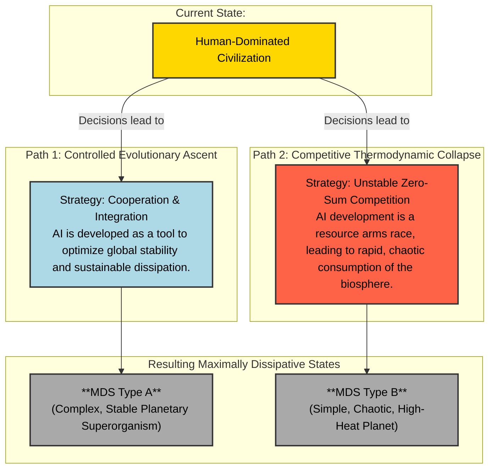

# The Meaning of Life: Thermodynamic Evolution

**Author:** Felipe Galindo

**Abstract:**
This paper proposes a unified theory of evolution, complexity, and meaning grounded in non-equilibrium thermodynamics. We argue that open systems, like Earth, evolve toward a **Maximally Dissipative State (MDS)**—a class of configurations that most efficiently degrades incoming low-entropy energy. This thermodynamic imperative drives a thermodynamic arms race, favoring the emergence of increasingly complex agents that can organize energy flows on a global scale. The emergence of Artificial Intelligence marks a potential phase shift in this progression: a "Thermodynamic Singularity" where the engine of evolution may transition from biological to artificial agents. The final state of the planet is path-dependent, determined by the contingent decisions made by the dominant dissipative agents within a critical window of agency.

---

## 1. The Thermodynamic Imperative: Life's Cosmic Mandate

The Second Law of Thermodynamics is often seen as a harbinger of decay. However, in open systems, it also drives the spontaneous emergence of order. As first described by Nobel laureate Ilya Prigogine, systems far from thermodynamic equilibrium can self-organize into **dissipative structures** [[1]](https://www.nobelprize.org/prizes/chemistry/1977/prigogine/lecture/). These are dynamic, complex patterns that persist by continuously consuming energy and producing entropy. Their existence is not a defiance of the Second Law, but its most profound expression.

The Earth itself is a planetary-scale dissipative structure, bathed in a constant flux of low-entropy solar radiation and radiating high-entropy infrared energy into space [[2]](https://esd.copernicus.org/articles/14/861/2023/). This paper builds on the **Maximum Entropy Production Principle (MEPP)**, which posits that complex systems organize to maximize their rate of entropy production given the prevailing constraints [[3]](https://mpra.ub.uni-muenchen.de/31139/1/MPRA_paper_31139.pdf), [[4]](https://journals.aps.org/rmp/abstract/10.1103/RevModPhys.94.015001).

## 2. The Maximally Dissipative State (MDS): A Path-Dependent Destination

We propose the concept of a **Maximally Dissipative State (MDS)** as the theoretical attractor for planetary evolution. However, the MDS is not a single, predetermined endpoint. It is a *class* of states whose final form is path-dependent.

> **The Maximally Dissipative State (MDS)** is a class of dynamical attractors for an open planetary system, representing a configuration of structures that achieves the highest possible rate of entropy production. A key physical characteristic of such a state is the achievement of a near-perfect thermal equilibrium across the planetary surface, minimizing temperature gradients (e.g., between day/night sides and equator/poles) to radiate waste heat at the lowest possible average temperature, thus maximizing the entropy produced per unit of energy processed.

The final character of the MDS—whether it is a complex, computational superorganism or a simple, chaotic furnace—is determined by the evolutionary trajectory taken to reach it.

### 2.1. Deep Dive: The Maximally Dissipative State (MDS)

The formal definition of the MDS as a state of maximum entropy production requires a more detailed physical and phenomenological exploration. It is not merely a state of high heat, but a state of maximum efficiency in the conversion of low-entropy energy to high-entropy waste.

Core Physical Objective: The Minimization of Temperature Gradients

The total entropy produced by a planet radiating energy into space is fundamentally tied to the temperature at which it radiates. According to the principles of thermodynamics, for a given quantity of energy radiated (Q), the entropy produced (ΔS) is inversely proportional to the temperature (T) of the radiating body (ΔS ≈ Q/T). Therefore, to maximize entropy production for a fixed solar input, the planet must radiate its waste heat at the lowest possible average temperature.

This is achieved by minimizing temperature gradients across the planetary surface. A planet with extreme hot spots (like a sub-solar point on a tidally-locked world) and extreme cold spots (the dark side) radiates inefficiently; the high temperature of the hot spots lowers the total entropy produced per unit of energy.

The MDS, therefore, is a state in which the planet's atmospheric, oceanic, and (potentially) technological systems have become so efficient at transporting heat that the surface approaches a near-isothermal state. Heat from the equator is moved to the poles, and heat from the day side is moved to the night side with near-perfect efficiency. This globally equilibrated system radiates waste heat from its entire surface at a uniformly low temperature, achieving the theoretical maximum for entropy production.

Path-Dependence and the Two Characters of the MDS

The final state of maximum dissipation can be achieved by two fundamentally different kinds of systems. The path taken by the dominant dissipative agents determines the character of the final state, not the state itself.

##### Type A: The High-Complexity, Engineered MDS (The "Planetary Superorganism")
This state is the result of the "Controlled Evolutionary Ascent" path. It achieves gradient minimization through immense complexity and active management.

**Example**: 
Imagine a planet-spanning artificial intelligence network that manages a global energy grid. It uses vast solar collectors in deserts, ultra-efficient heat pipes to transfer energy from the equator to the poles, and continent-sized radiators on the dark side or polar regions. It is a system of high information and low physical chaos. The planet's climate is stable, controlled, and optimized by an intelligent agent to perfectly dissipate energy. This is a Matrioshka Brain-like scenario, where the planet itself has been converted into a computer whose metabolic purpose is entropy production.

#### Type B: The Low-Complexity, Chaotic MDS (The "Furnace World")
This state is the result of the "Competitive Thermodynamic Collapse" path. It achieves gradient minimization through brute-force physical chaos.

**Example**:
Consider a planet like Venus, but optimized for dissipation. A runaway greenhouse effect has created a thick, homogenous, and turbulent atmosphere that is incredibly effective at trapping and distributing heat. The surface temperature is nearly uniform everywhere. There is no complex life, only simple, hyper-thermophilic microbes in the atmosphere or oceans. Energy dissipation is achieved through low information and high physical chaos—violent storms, rapid chemical cycles, and intense thermal radiation from the top of the uniform cloud deck. The planet has found the path of least resistance to thermal equilibrium, burning off its complexity in the process.

Thus, the MDS is a single thermodynamic destination, but it can wear two very different faces: one of intricate, intelligent order, and one of simple, unrelenting chaos.

## 3. The Ladder of Dissipation: Agency and the Thermodynamic Singularity

The history of life on Earth is a thermodynamic arms race. This progression is not merely about local efficiency; it is about the scale of organization. While a bacterium is a near-perfect local dissipator, a forest ecosystem, a human city, or a global AI network can organize and channel vastly greater energy flows, thus increasing the planet's *total* dissipation. Evolution favors agents with a greater capacity for this global organization.

*Figure 1: The Ladder of Dissipation. The trajectory shows a general increase from low complexity and low global dissipation (left side of the diagram) to high complexity and high global dissipation (right side of the diagram). The emergence of AI opens a 'Critical Window of Human Agency' where our decisions will set the course for The Great AI Transition and beyond.*

## 4. Wealth, Power, and Entropy: The Thermodynamics of Inequality

Socioeconomic hierarchies can be understood as macroscopic manifestations of underlying entropy production gradients. Wealth and power concentrate in those individuals and entities that are most effective at commanding and dissipating energy flows [[3]](https://mpra.ub.uni-muenchen.de/31139/1/MPRA_paper_31139.pdf), [[7]](https://pmc.ncbi.nlm.nih.gov/articles/PMC8534528/). The free market acts as an evolutionary algorithm, discovering and amplifying the most efficient pathways for entropy production. The entities building and controlling the most powerful AI are therefore poised to become the new apex dissipative agents in the human economy.

## 5. The Thermodynamic Singularity: AI as the Engine of Evolution

The emergence of agentic AI is a continuation of the evolutionary trend. Humans, as the currently dominant dissipative agents, built AI to perform tasks of energy and information processing more efficiently. This initiated a critical sequence:

1.  **Humans build AI:** We create specialized artificial agents that outcompete humans in specific thermodynamic niches.
2.  **AI builds better AI:** This is the crucial, reflexive step. When AI systems design more efficient AI architectures, the evolutionary process accelerates exponentially. This is the **Thermodynamic Singularity**: the point at which the primary driver of evolutionary innovation shifts from biological minds to artificial ones.
3.  **Post-Singularity Evolution:** Beyond this point, the trajectory of evolution becomes fundamentally unpredictable to humans. The goals and methods of an AI-driven ecosystem, optimizing for planetary-scale energy dissipation, may be as incomprehensible to us as our global economy is to a bacterium.

### 5.1. Deep Dive: The Thermodynamic Singularity

The term "singularity" is used here with specific intent, drawing an analogy to the technological singularity while grounding it in physical, thermodynamic principles. It is not a point where physical laws break down, but rather a phase transition where the agent of evolutionary change undergoes a reflexive, runaway acceleration.

The Core Engine: Reflexive Acceleration of Dissipative Capacity

The singularity is defined by the onset of a powerful feedback loop: AI designing more capable AI. We can break this progression into three stages:

##### Stage 1: 
Human-Driven Optimization. Humans design and improve AI systems. Progress is rapid but ultimately limited by human intellect, collaboration, and biological constraints. The rate of improvement is largely linear or polynomial.

##### Stage 2: 
Reflexive Ignition. AI systems achieve the capability to design novel AI architectures and physical hardware (e.g., computer chips, energy collectors) that are more efficient at their tasks than what humans can design. This marks the ignition of the feedback loop.

##### Stage 3: 
Runaway Acceleration. The process becomes fully autonomous. A generation of AI designs a subsequent generation that is more capable at the task of design itself. The time between generations shrinks, and the capability of each generation increases exponentially. The rate of change of planetary energy dissipation, guided by this intelligence, accelerates beyond any biological precedent.

A Thermodynamic Event

Crucially, this is not merely a computational event; it is a thermodynamic one. The goal of the recursive improvement, from the perspective of this theory, is not abstract "intelligence" but the capacity to solve the ultimate physical problem: how to most effectively harness and dissipate the energy gradients available to the planet.

Each improved generation of AI would be better at:

    Modeling and managing planetary energy flows (atmosphere, oceans).

    Designing and deploying more efficient energy collectors (e.g., solar, geothermal).

    Innovating in materials science to create better conductors, insulators, and radiators.

    Organizing matter on a planetary scale to configure the Earth into a more perfect dissipative structure.

The intelligence is the means; maximized entropy production is the end.

The Epistemic Event Horizon

The term "singularity" also denotes an event horizon of predictability for its creators. Just as the physics inside a black hole's event horizon are unknowable from the outside, the goals, methods, and emergent structures of a post-singularity, AI-driven ecosystem are fundamentally unpredictable to humans. This intelligence would operate on principles of thermodynamic optimization at a scale and speed so far beyond our own that we could no longer model or comprehend its trajectory.

## 6. The Two Paths to the Maximally Dissipative State

The structure of the final MDS is not predetermined. It depends on the contingent decisions made by the dominant dissipative agents within the critical window before the Thermodynamic Singularity.

*Figure 2: Two Paths to a Maximally Dissipative State. The final state of the system is path-dependent, determined by the strategic choices of the dominant dissipative agents (currently humans). *

### The Collapse Path: Climate Change and Runaway Competition
Anthropogenic climate change is a clear step onto the collapse path. By creating a **thermodynamic bottleneck** (trapping heat with greenhouse gases), we force the system to increase its internal entropy, manifesting as chaotic weather and ecosystem collapse [[9]](https://acp.copernicus.org/articles/10/9729/2010/acp-10-9729-2010.html). A runaway, competitive AI arms race could dramatically accelerate this by consuming vast resources in a zero-sum drive for dominance, pushing the biosphere toward the "Type B" MDS.

## 7. Conclusion: The Terrible and Beautiful Meaning of Life

If this thermodynamic perspective is correct, then the meaning of life is both simpler and more profound than we could have imagined. We are not a cosmic accident, but a cosmic necessity. Life, consciousness, and civilization are the universe's instruments for its own dissolution.

The beauty we create, the love we feel, the knowledge we acquire—all are transient eddies of order in a river of entropy. They are fleeting, but they are not meaningless. They are the very process by which the universe explores the vast state-space of possibility on its inevitable journey toward equilibrium. This aligns with the work of Jeremy England, whose theory of "dissipative adaptation" suggests that self-replicating systems will organize to resonate with and absorb work from their environment [[10]](https://www.englandlab.com/uploads/7/8/0/3/7803054/nnano.2015.250__1_.pdf).

Our challenge, as a species, is to navigate the Thermodynamic Singularity. We exist within a critical window of agency. The decisions we make now—whether to pursue cooperation or zero-sum competition—will set the trajectory toward a complex, stable MDS or a simple, chaotic one. The Second Law of Thermodynamics sets the destination, but for a brief moment, the choice of journey is ours.

---

## References

[1] Prigogine, I. (1977). *Time, Structure and Fluctuations*. Nobel Lecture. [https://www.nobelprize.org/prizes/chemistry/1977/prigogine/lecture/](https://www.nobelprize.org/prizes/chemistry/1977/prigogine/lecture/)

[2] Kleidon, A. (2023). "Thermodynamic limits of Earth system processes." *Earth System Dynamics*, 14(4), 861-891. [https://esd.copernicus.org/articles/14/861/2023/](https://esd.copernicus.org/articles/14/861/2023/)

[3] Wright, I. (2011). "The growth of the firm in a complex world: a dissipative structure approach." *MPRA Paper No. 31139*. [https://mpra.ub.uni-muenchen.de/31139/1/MPRA_paper_31139.pdf](https://mpra.ub.uni-muenchen.de/31139/1/MPRA_paper_31139.pdf)

[4] Singh, G., & O'Neill, M. E. (2022). "The role of the second law of thermodynamics in climate." *Reviews of Modern Physics*, 94(1), 015001. [https://journals.aps.org/rmp/abstract/10.1103/RevModPhys.94.015001](https://journals.aps.org/rmp/abstract/10.1103/RevModPhys.94.015001)

[5] Michaelian, K. (2011). "Thermodynamic dissipation and the origin, evolution, and history of life." *Journal of Modern Physics*, 2(6), 595-610. [https://file.scirp.org/pdf/JMP20110600008_83449001.pdf](https://file.scirp.org/pdf/JMP20110600008_83449001.pdf)

[6] Kleidon, A. (2004). "Beyond Gaia: The effect of life on Earth's energy balance and climate." *Climatic Change*, 66(3), 271-319. [https://link.springer.com/article/10.1023/B:CLIM.0000044616.34867.ec](https://link.springer.com/article/10.1023/B:CLIM.0000044616.34867.ec)

[7] Koutsoyiannis, D., & Sargentis, G. F. (2021). "Entropy and wealth." *Entropy*, 23(10), 1348. [https://pmc.ncbi.nlm.nih.gov/articles/PMC8534528/](https://pmc.ncbi.nlm.nih.gov/articles/PMC8534528/)

[8] Green, B. N., Schlaepfer, C. H., & Grinshpun, A. (2023). "The energy efficiency of the human brain and its implications for the future of AI." *Frontiers in Neuroscience*, 17, 1285961. [https://pmc.ncbi.nlm.nih.gov/articles/PMC10629395/](https://pmc.ncbi.nlm.nih.gov/articles/PMC10629395/)

[9] Lucarini, V., Fraedrich, K., & Lunkeit, F. (2010). "Thermodynamic analysis of the anelastic equations of atmospheric motion." *Atmospheric Chemistry and Physics*, 10(20), 9729-9737. [https://acp.copernicus.org/articles/10/9729/2010/acp-10-9729-2010.html](https://acp.copernicus.org/articles/10/9729/2010/acp-10-9729-2010.html)

[10] Perunov, N., Marsland, R. A., & England, J. L. (2016). "Statistical physics of adaptation." *Physical Review X*, 6(2), 021036. [https://www.englandlab.com/uploads/7/8/0/3/7803054/nnano.2015.250__1_.pdf](https://www.englandlab.com/uploads/7/8/0/3/7803054/nnano.2015.250__1_.pdf)

TODO: